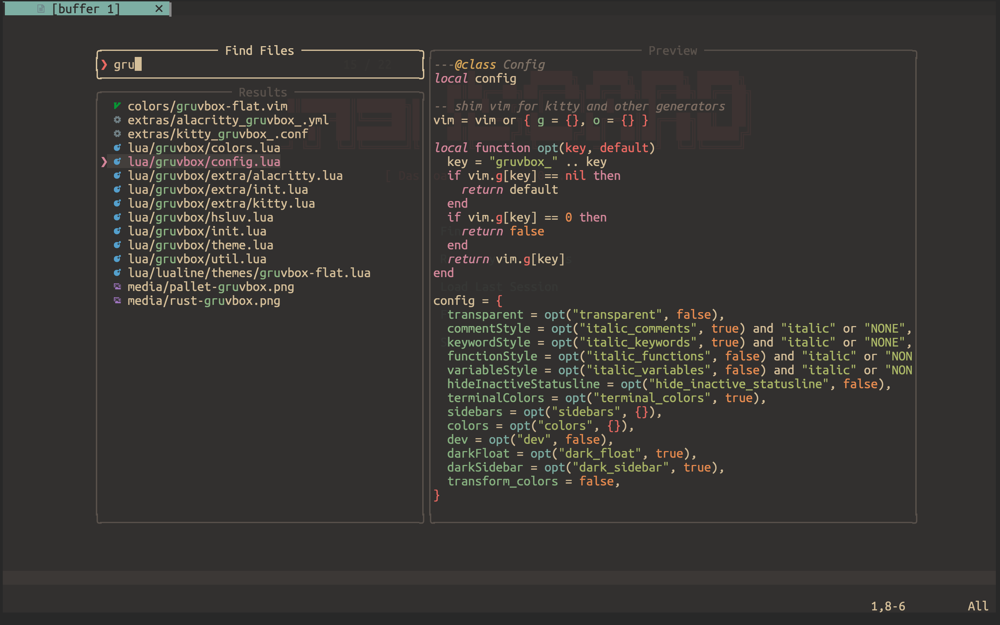
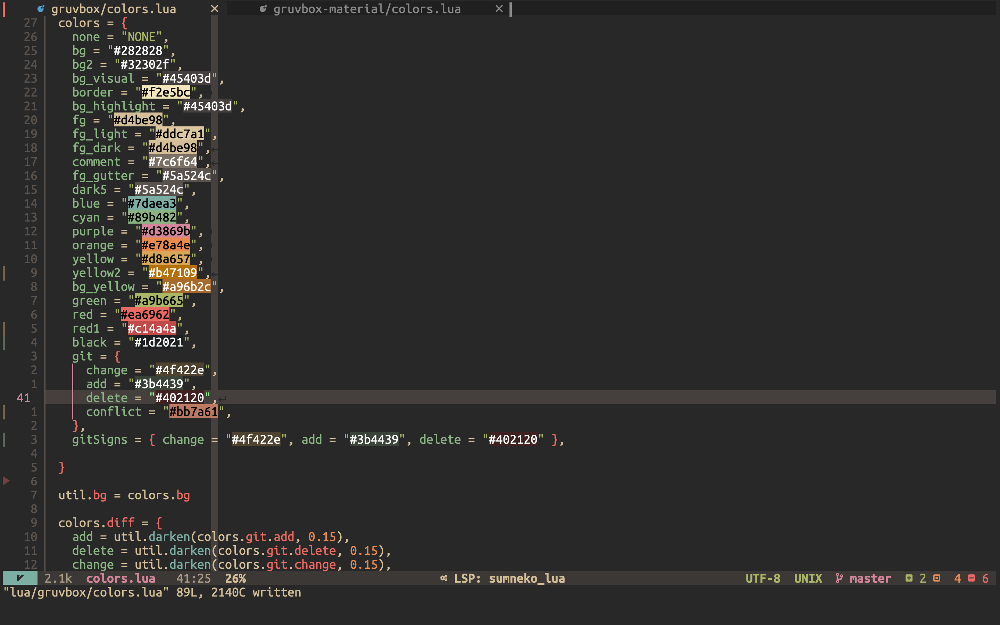
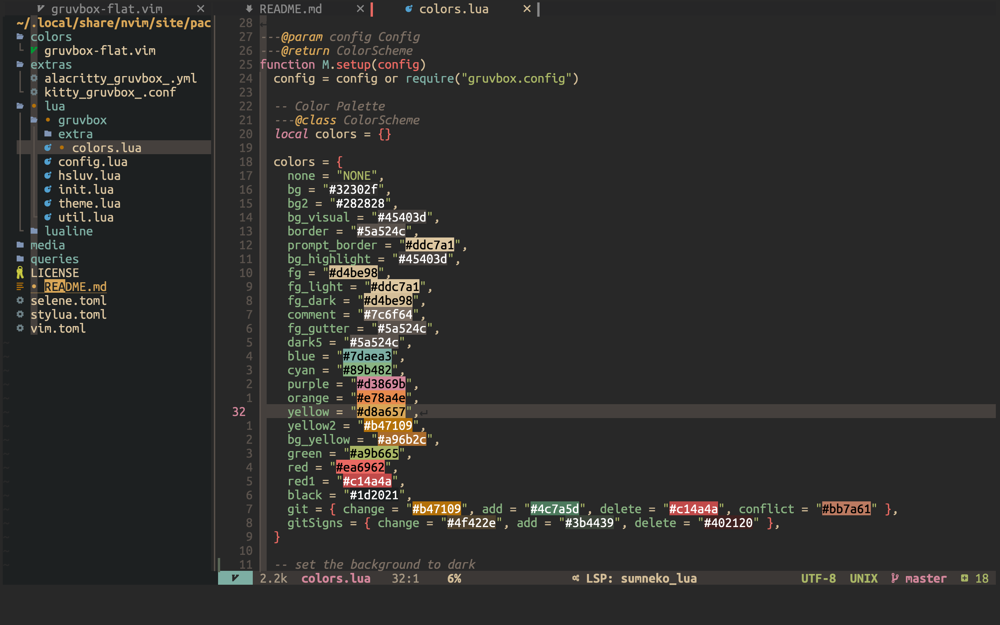
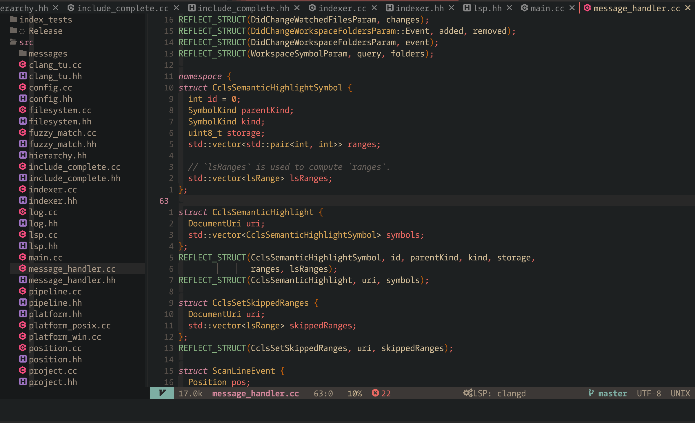
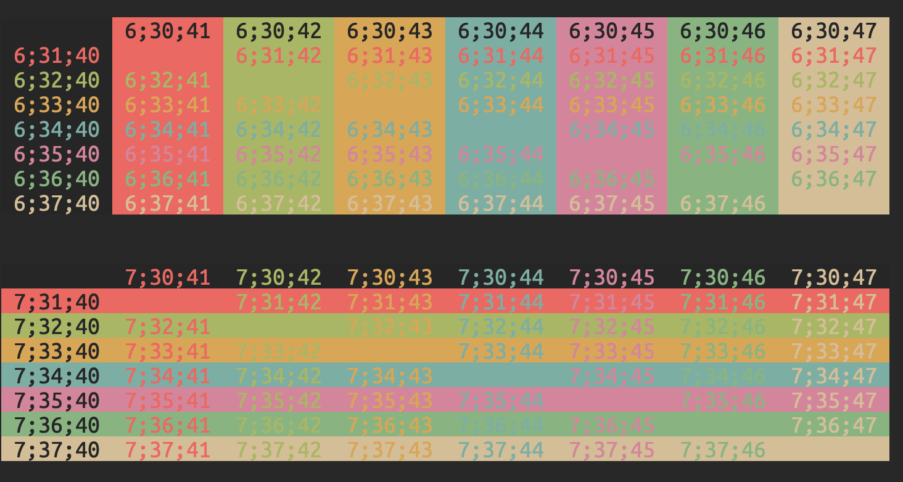

# Gruvbox Flat

A dark beautiful Neovim theme written in Lua. [Coming soon] extra themes for Kitty and Alacritty
- Inspired by [sainnhe's gruvbox-material](https://github.com/sainnhe/gruvbox-material) but written in lua
- A fork of [onedark.nvim](https://github.com/monsonjeremy/onedark.nvim)





## ✨ Features

- supports the latest Neovim 0.5 features like TreeSitter and LSP
- minimal inactive statusline (currently bugged)
- vim terminal colors
- darker background for sidebar-like windows
- **lualine** theme

### Plugin Support

- [TreeSitter](https://github.com/nvim-treesitter/nvim-treesitter)
- [LSP Diagnostics](https://neovim.io/doc/user/lsp.html)
- [LSP Trouble](https://github.com/folke/lsp-trouble.nvim)
- [LSP Saga](https://github.com/glepnir/lspsaga.nvim)
- [Git Signs](https://github.com/lewis6991/gitsigns.nvim)
- [Git Gutter](https://github.com/airblade/vim-gitgutter)
- [Telescope](https://github.com/nvim-telescope/telescope.nvim)
- [NvimTree](https://github.com/kyazdani42/nvim-tree.lua)
- [WhichKey](https://github.com/liuchengxu/vim-which-key)
- [Indent Blankline](https://github.com/lukas-reineke/indent-blankline.nvim)
- [Dashboard](https://github.com/glepnir/dashboard-nvim)
- [BufferLine](https://github.com/akinsho/nvim-bufferline.lua)
- [Lualine](https://github.com/hoob3rt/lualine.nvim)
- [Lightline](https://github.com/itchyny/lightline.vim)
- [Neogit](https://github.com/TimUntersberger/neogit)
- [Hop](https://github.com/phaazon/hop.nvim)
- [Bat](https://github.com/sharkdp/bat) follow [this tutorial](https://github.com/sharkdp/bat#adding-new-themes) the .thTheme file is located in [extras](./extras)
- [Delta](https://github.com/dandavison/delta)

## ⚡️ Requirements

- Neovim >= 0.5.0

## 📦 Installation

Install the theme with your preferred package manager:

[vim-plug](https://github.com/junegunn/vim-plug)

```vim
Plug 'eddyekofo94/gruvbox-flat.nvim'
```

[packer](https://github.com/wbthomason/packer.nvim)

```lua
use 'eddyekofo94/gruvbox-flat.nvim'
```

[lazy.nvim](https://github.com/folke/lazy.nvim)
```
return {
    'eddyekofo94/gruvbox-flat.nvim',
    priority = 1000,
    enabled = true,
    config = function()
        vim.cmd([[colorscheme gruvbox-flat]])
    end,
}
```

## 🚀 Usage

Enable the colorscheme:

```vim
" Vim Script
colorscheme gruvbox-flat
```

```lua
-- Lua
vim.cmd[[colorscheme gruvbox-flat]]
```

To enable the `gruvbox` theme for `Lualine`, simply specify it in your lualine settings:

```lua
require('lualine').setup {
  options = {
    theme = 'gruvbox-flat'
    -- ... your lualine config
  }
}
```

To enable the `gruvbox-flat` colorscheme for `Lightline`:

```vim
" Vim Script
let g:lightline = {'colorscheme': 'gruvbox-flat'}
```

To enable darker mode
```lua
vim.g.gruvbox_flat_style = "dark"

```


To enable harder mode
```lua
vim.g.gruvbox_flat_style = "hard"

```


## ⚙️ Configuration

> ❗️ configuration needs to be set **BEFORE** loading the color scheme with `colorscheme gruvbox-flat`

| Option                           | Default | Description                                                                                                                                                     |
| -------------------------------- | ------- | --------------------------------------------------------------------------------------------------------------------------------------------------------------- |
| gruvbox_terminal_colors          | `true`  | Configure the colors used when opening a `:terminal` in Neovim                                                                                                  |
| gruvbox_italic_comments          | `true`  | Make comments italic                                                                                                                                            |
| gruvbox_italic_keywords          | `true`  | Make keywords italic                                                                                                                                            |
| gruvbox_italic_functions         | `false` | Make functions italic                                                                                                                                           |
| gruvbox_italic_variables         | `false` | Make variables and identifiers italic                                                                                                                           |
| gruvbox_transparent              | `false` | Enable this to disable setting the background color                                                                                                             |
| gruvbox_hide_inactive_statusline | `false` | Enabling this option, will hide inactive statuslines and replace them with a thin border instead. Should work with the standard **StatusLine** and **LuaLine**. |
| gruvbox_sidebars                 | `{}`    | Set a darker background on sidebar-like windows. For example: `["qf", "vista_kind", "terminal", "packer"]`                                                      |
| gruvbox_dark_sidebar             | `true`  | Sidebar like windows like `NvimTree` get a darker background                                                                                                    |
| gruvbox_dark_float               | `true`  | Float windows like the lsp diagnostics windows get a darker background.                                                                                         |
| gruvbox_colors                   | `{}`    | You can override specific color groups to use other groups or a hex color                                                                                       |
| gruvbox_theme                    | `{}`    | You can override specific highlight groups to use other color groups or a hex color                                                                             |

```lua
-- Example config in Lua
vim.g.gruvbox_italic_functions = true
vim.g.gruvbox_sidebars = { "qf", "vista_kind", "terminal", "packer" }

-- Change the "hint" color to the "orange" color, and make the "error" color bright red
vim.g.gruvbox_colors = { hint = "orange", error = "#ff0000" }

-- Change the TabLineSel highlight group (used by barbar.nvim) to the "orange" color
vim.g.gruvbox_theme = { TabLineSel = { bg = "orange" } }

-- Load the colorscheme
vim.cmd[[colorscheme gruvbox-flat]]
```

```vim
" Example config in VimScript
let g:gruvbox_italic_functions = 1
let g:gruvbox_sidebars = [ "qf", "vista_kind", "terminal", "packer" ]

" Load the colorscheme
colorscheme gruvbox-flat
```

### Making `undercurls` work properly in **Tmux**

To have undercurls show up and in color, add the following to your **Tmux** config file:

```sh
# Undercurl
set -g default-terminal "${TERM}"
set -as terminal-overrides ',*:Smulx=\E[4::%p1%dm'  # undercurl support
set -as terminal-overrides ',*:Setulc=\E[58::2::%p1%{65536}%/%d::%p1%{256}%/%{255}%&%d::%p1%{255}%&%d%;m'  # underscore colours - needs tmux-3.0
```

## 🍭 Extras

Extra color configs for **Kitty**, and **Alacritty** can be found in [extras](extras/). To use them, refer to their respective documentation.
- To generate the configs `:luafile /lua/gruvbox/extra/init.lua`



### ✅ TODO
- [x]  Generate theme for Kitty
- [x]  Generate theme for Alacritty
- [ ]  Add light theme (hopefully one of these days)
- [x]  Add hard/darker theme (still has some more improvements to go)

